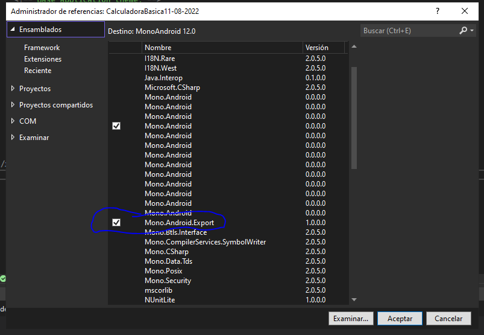
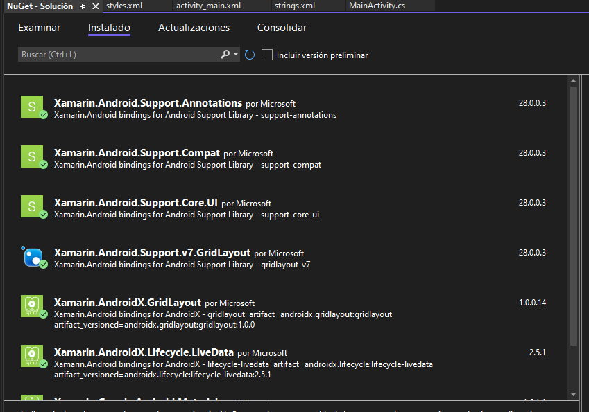
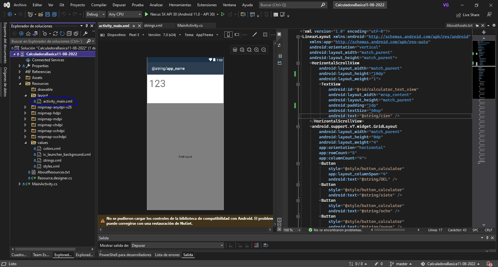
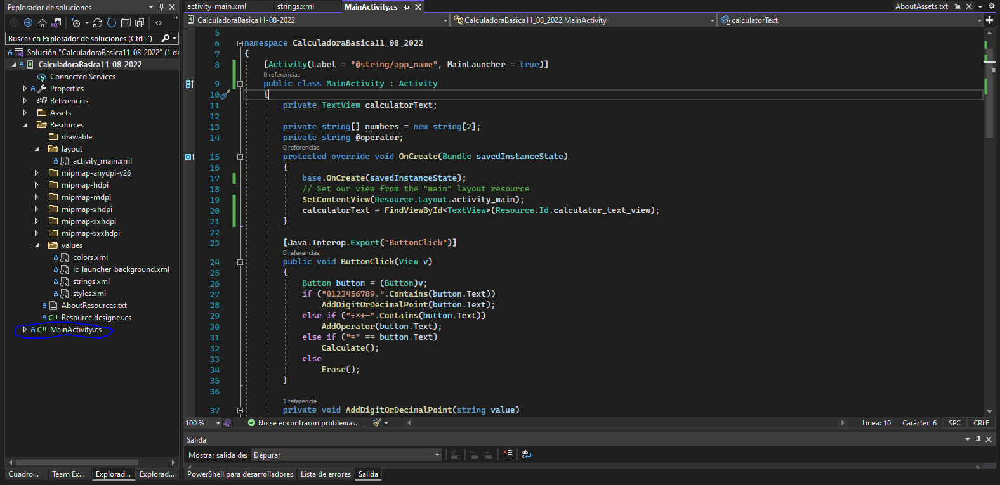
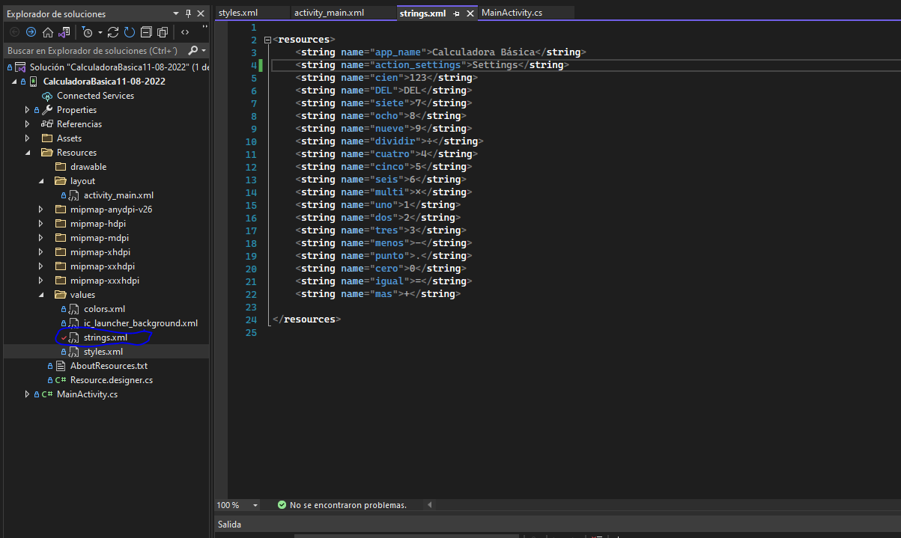
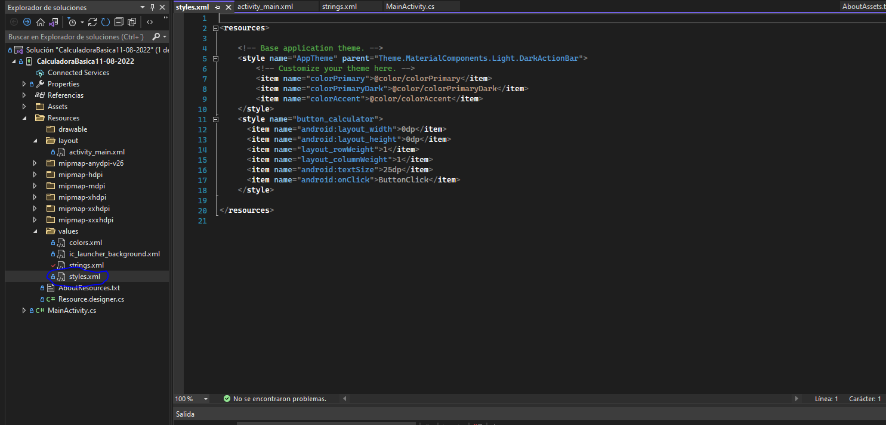

# CalculadoraXamarinApp

Ejemplo de Aplicaion en android nativo Xamarin App
 
### Instalando libliotecas y Herramiantas
 
- Dar click derecho sobre Referencia como indica imagen para agreagar una nueva referencia
 

 
- Marcar la opción Mono.Android.Export como indica la imagen 
 

 
- Intalando paquetes NuGEt necesario como indica la imagen
 

 
### Realización
 
- Editar el Archivo activity_main.xml
 

 
- Editar el archivo MainActivity.cs
 

 
- Editar el Archivo strings.xml
 

 
- Editar el Archivo styles.xml
 

