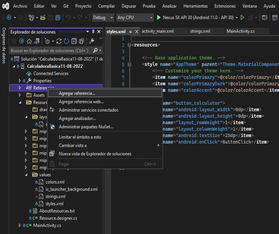
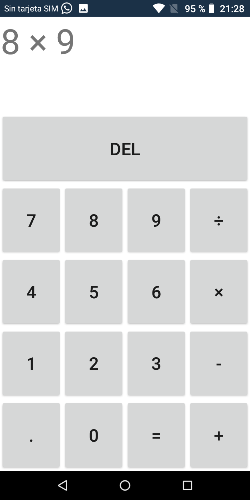
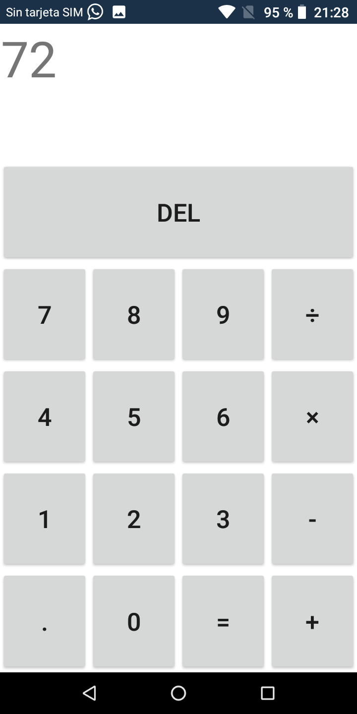

# CalculadoraXamarinApp

Ejemplo de Aplicaion en android nativo Xamarin App
 
### Instalando libliotecas y Herramiantas

- Dar click derecho sobre Referencia como indica imagen para agreagar una nueva referencia

- Marcar la opción Mono.Android.Export como indica la imagen 

- Intalando paquetes NuGEt necesario como indica la imagen

 

### Realización
 
- Editar el Archivo activity_main.xml

- Editar el archivo MainActivity.cs

- Editar el Archivo strings.xml

- Editar el Archivo styles.xml

 

### Prueba aplicación en producción
 

- Imagen de Aplicación corriendo

- Ejemplo Multiplicación

- Resultado

